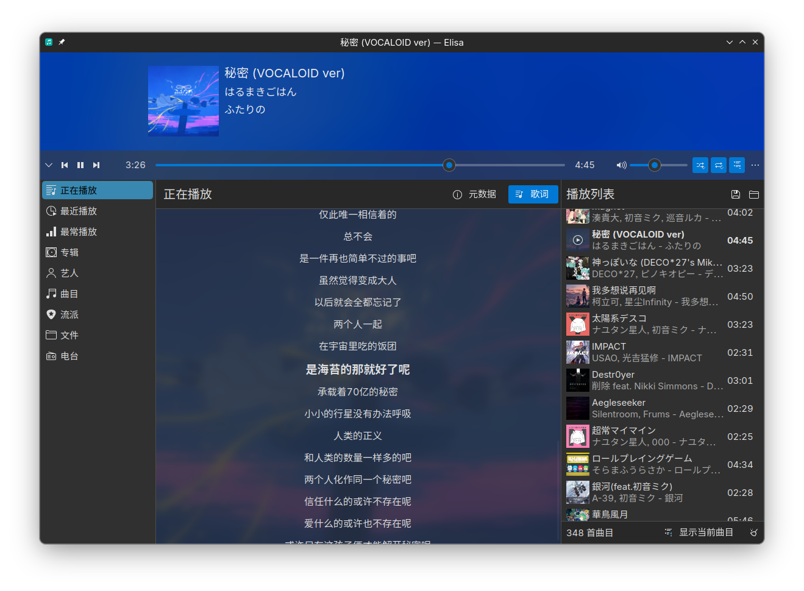

<!--
SPDX-FileCopyrightText: 2017 Matthieu Gallien <matthieu_gallien@yahoo.fr>
SPDX-FileCopyrightText: 2023 Nate Graham <nate@kde.org>

SPDX-License-Identifier: LGPL-3.0-or-later
-->

# Elisa-Yuki

我对 KDE 的音乐播放器 [Elisa](https://apps.kde.org/elisa/) 的 fork，对界面和功能进行了一些微调，以符合我的使用需求。

功能上，支持从 LRC 文件读取歌词，并且默认禁用了 D-Bus Activatable。

**这些更改不会被合并到上游。**

